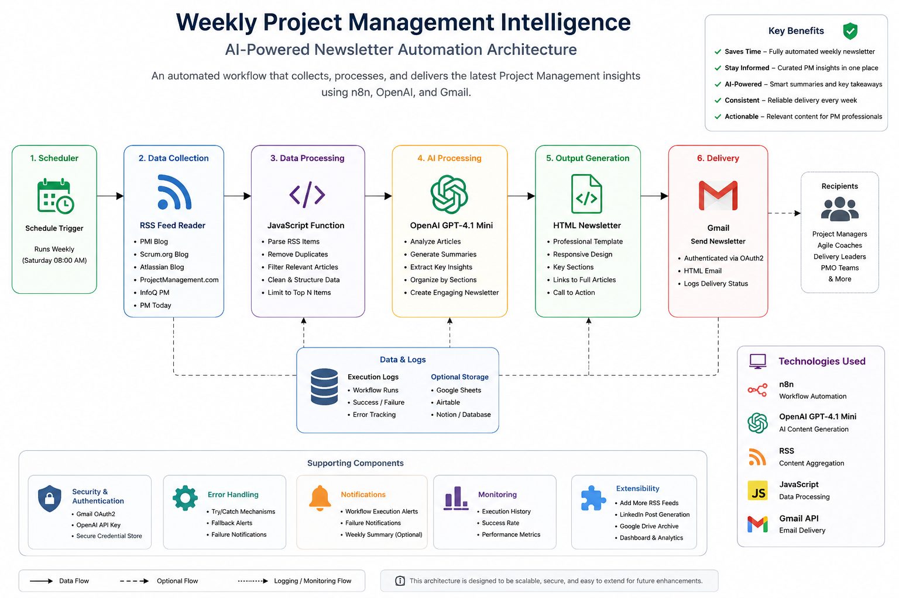
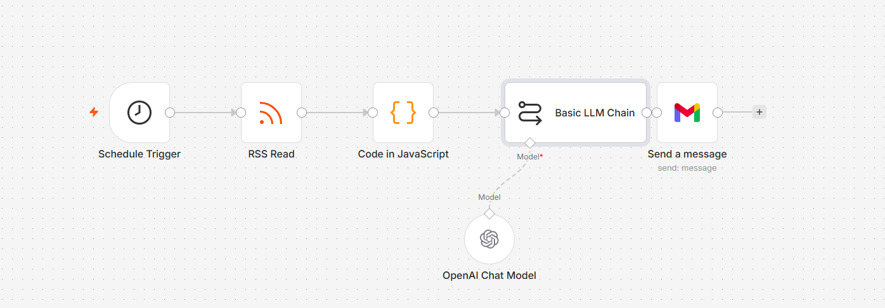
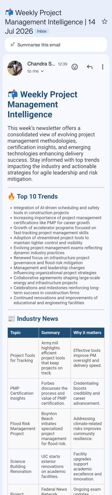
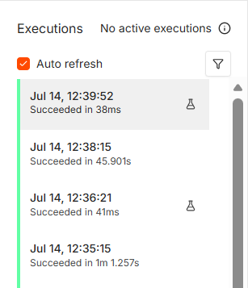

[](https://platform.openai.com/)
[](https://n8n.io/)
[](https://developer.mozilla.org/docs/Web/JavaScript)
[](LICENSE)
[](#)

# 📬 Weekly Project Management Intelligence

Automate your weekly Project Management intelligence with AI, n8n, OpenAI GPT-4.1, RSS feeds, and Gmail—delivering curated insights directly to your inbox every week.

---
<p align="center">
  
</p>

## 📖 Overview
---

## ✨ Features

- 🤖 AI-powered Project Management newsletter generation
- 📰 Aggregates articles from multiple trusted RSS feeds
- 🧠 Uses OpenAI GPT-4.1 for intelligent summarization
- 📧 Automatically sends HTML newsletters through Gmail
- ⏰ Weekly scheduled execution using n8n Schedule Trigger
- ⚡ JavaScript preprocessing for filtering and formatting
- 📱 Responsive HTML email compatible with major email clients
- 🔒 Secure OAuth authentication for Gmail integration
- 💰 Low operating cost with configurable OpenAI usage
- 🔧 Easily extensible for additional RSS feeds or delivery channels

This project automates the creation and delivery of a professional weekly Project Management newsletter using AI and workflow automation.

Instead of manually browsing multiple Project Management websites every week, this workflow automatically:

- Collects articles from leading PM websites using RSS feeds
- Filters relevant content
- Uses OpenAI GPT-4.1 to summarize and categorize insights
- Generates a professional HTML newsletter
- Sends the newsletter automatically via Gmail every Saturday

The solution is built completely in **n8n**, making it easy to customize, extend, and deploy.

---

## ✨ Features

- 🤖 AI-powered newsletter generation
- 📚 Collects articles from multiple PM RSS feeds
- 📰 Weekly automated digest
- 📧 Automatic Gmail delivery
- 🧠 GPT-4.1 summarization
- ⚡ Built completely in n8n
- 📈 Easily extensible
- 🔒 Uses OAuth authentication
- 💰 Low-cost execution

---

## 🏗 Workflow

The automation follows a six-stage pipeline:

| Step | Component | Purpose |
|------|-----------|----------|
| 1 | Schedule Trigger | Starts the workflow every Saturday |
| 2 | RSS Reader | Collects the latest Project Management articles |
| 3 | JavaScript Function | Cleans, filters, and prepares article data |
| 4 | OpenAI GPT-4.1 | Generates summaries, key insights, and newsletter content |
| 5 | HTML Generator | Creates a professional email layout |
| 6 | Gmail | Delivers the newsletter automatically |

---

## 📸 Screenshots

### n8n Workflow

<p align="center">

</p>

---

### Newsletter Preview

<p align="center">

</p>

---

### Successful Execution

<p align="center">

</p>

### n8n Workflow

<p align="center">
  
</p>

### Newsletter


### Execution


---


## 🚀 Installation

### Prerequisites

- n8n (Cloud or Self-hosted)
- OpenAI API Key
- Gmail Account
- Gmail OAuth Credentials

### Steps

1. Clone the repository

```bash
git clone https://github.com/ChandraPMDM/weekly-project-management-intelligence.git
```

2. Import

```
workflow/Weekly_PM_Intelligence_Template.json
```

into your n8n workspace.

3. Configure

- OpenAI Credentials
- Gmail Credentials
- Schedule Trigger

4. Activate the workflow.

5. Execute once manually to verify configuration.

The workflow will then execute automatically every week.

---

## ⚙ Configuration

Configure the following before activation:

| Component | Required |
|-----------|----------|
| OpenAI API Key | ✅ |
| Gmail OAuth | ✅ |
| RSS Feed URLs | Optional |
| Schedule | Optional |
| Email Recipients | ✅ |

All credentials are securely stored within n8n.

---

## 📂 Repository Structure

```
weekly-project-management-intelligence
│
├── assets/
│   └── architecture.png
│
├── docs/
│   ├── CONTRIBUTING.md
│   ├── INSTALLATION.md
│   ├── ARCHITECTURE.md
│   └── PROMPTS.md
│
├── screenshots/
│   ├── workflow/
│   ├── Newsletter.png
│   └── Execution.png
│
├── workflow/
│   └── Weekly_PM_Intelligence_Template.json
│
├── CHANGELOG.md
├── LICENSE
└── README.md
```
---

## 🛠 Technologies Used

| Technology | Purpose |
|------------|----------|
| n8n | Workflow Automation |
| OpenAI GPT-4.1 | AI Content Generation |
| JavaScript | Data Processing |
| RSS | Article Collection |
| Gmail API | Email Delivery |
| HTML | Newsletter Formatting |

---

## 📅 Roadmap

- [x] Weekly AI Newsletter
- [x] Gmail Delivery
- [x] RSS Integration
- [x] OpenAI Summarization
- [ ] LinkedIn Post Generator
- [ ] PDF Newsletter Export
- [ ] Microsoft Teams Notifications
- [ ] Slack Integration
- [ ] Outlook Delivery
- [ ] Power BI Dashboard

---

## 🤝 Contributing

Contributions are welcome.

If you'd like to improve this project:

1. Fork the repository.
2. Create a feature branch.
3. Commit your changes.
4. Submit a Pull Request.

Ideas, bug reports, and feature requests are always appreciated.

---

## 📜 License

This project is licensed under the MIT License.

See the LICENSE file for more information.
